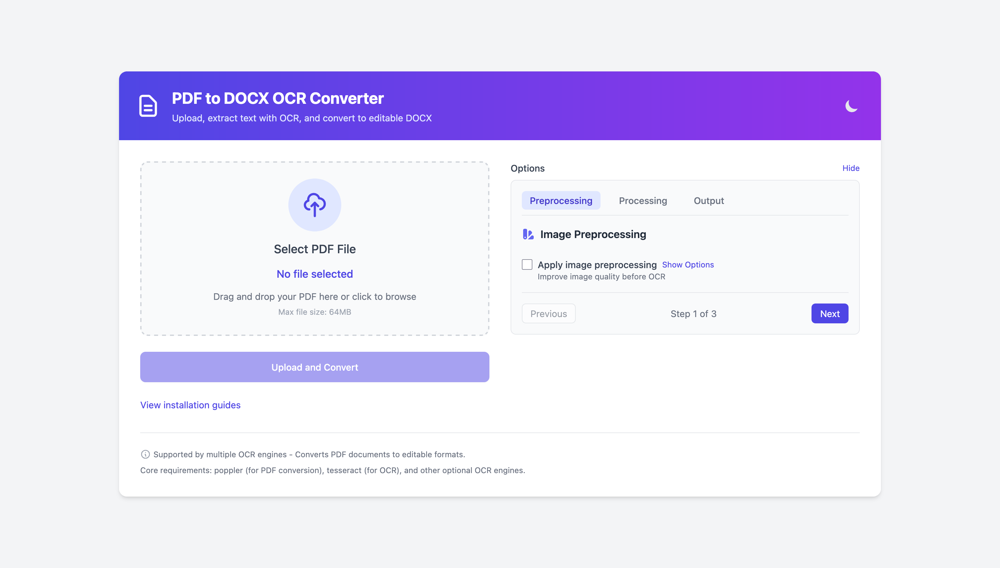
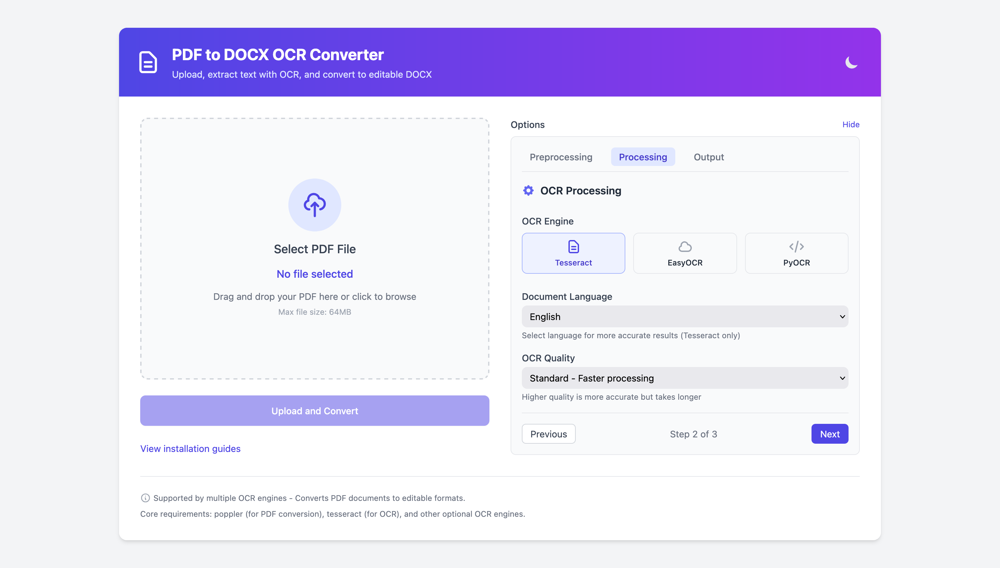
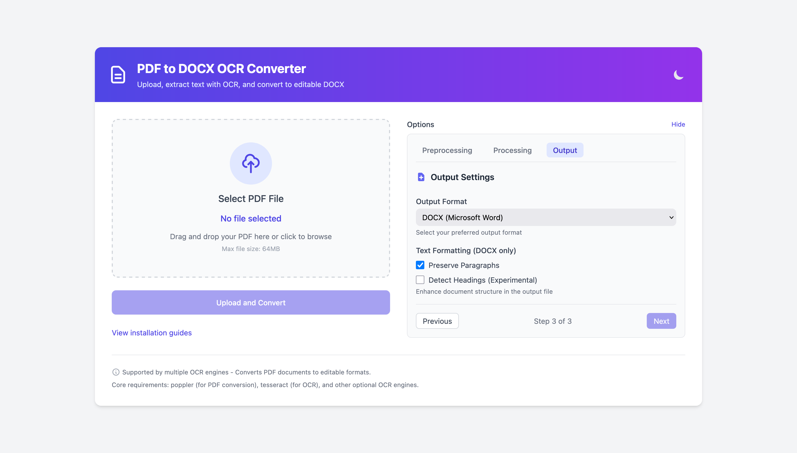
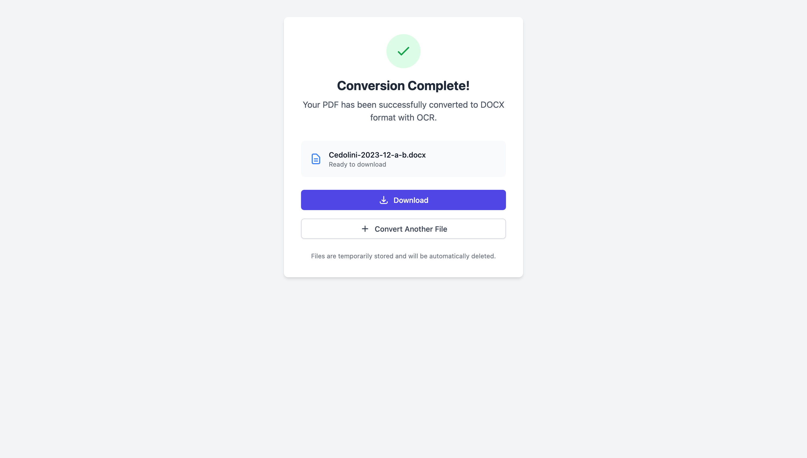

# pdf-ocr

[](https://github.com/fabriziosalmi/pdf-ocr/actions/workflows/ci.yml)
[](https://www.python.org/downloads/)
[](https://opensource.org/licenses/MIT)

A small **Flask web app** that turns scanned/image PDFs into editable text formats
(**DOCX, TXT, Markdown, HTML**) using OCR. You upload a PDF in the browser, it renders
each page to an image with Poppler, runs OCR (Tesseract by default), and gives you the
extracted text back as a downloadable file.

This is a working single-file application (`app.py`, ~920 lines) with a unit-test suite
— not a stub. It is a **useful local/self-hosted tool**, not a hardened multi-tenant
service. See [What works today vs. Roadmap](#what-works-today-vs-roadmap) for an honest
feature-by-feature breakdown before you rely on any specific capability.

## Screenshots






## Quickstart (Docker)

Docker is the fastest path because the image already contains Tesseract and Poppler,
so you don't have to install anything else:

```bash
git clone https://github.com/fabriziosalmi/pdf-ocr.git
cd pdf-ocr
cp .env.example .env && python -c 'import secrets; print("SECRET_KEY=" + secrets.token_hex(32))' >> .env
docker compose up --build
```

`SECRET_KEY` signs the session cookie. The app refuses to start without it unless
`FLASK_ENV=development` is set — a key generated per process would differ in every
gunicorn worker, silently invalidating sessions.

Then open <http://localhost:8011>, drop a PDF onto the page, pick an output format,
and download the result.

### Run locally without Docker

You need the two system binaries first (Python packages alone are not enough):

```bash
# macOS
brew install tesseract poppler
# Debian/Ubuntu
# sudo apt-get install -y tesseract-ocr poppler-utils

pip install -r requirements.txt

# Development server (Werkzeug, single-threaded — local use only)
FLASK_ENV=development python app.py             # http://127.0.0.1:8011

# Or the way the container serves it
SECRET_KEY=$(python -c 'import secrets; print(secrets.token_hex(32))') \
  gunicorn --bind 127.0.0.1:8011 --workers 2 --threads 4 app:app
```

To confirm the OCR toolchain is actually wired up on your machine:

```bash
python ocr_test.py                # renders a test image, OCRs it, prints PASS/FAIL
```

## Demo (input → output)

The conversion flow is: **PDF → Poppler renders each page to PNG → OCR engine reads the
image → text is written to your chosen format.** OCR quality depends entirely on the
scan quality of your input.

For example, two OCR'd pages of an invoice come back as Markdown like this (this is the
literal output of the app's Markdown writer, with `---` marking a page break):

```markdown
ACME Corporation

Invoice No. 2024-0042
Date: 2024-11-03

Total due: 1,250.00 EUR

---

Terms: Net 30 days.
Thank you for your business.
```

The same pages exported as HTML wrap each paragraph in `<p>` tags, escape HTML entities,
and insert `<hr class="page-break">` between pages. DOCX output writes one paragraph per
text block with a page break between pages (plain text — see the roadmap note on layout).

## What works today vs. Roadmap

The application genuinely does the core job. Some capabilities described in older versions
of this README were aspirational; they are listed under Roadmap below so expectations match
the code.

### Works today (verified in the code)

- **Web upload → convert → download** flow with a background worker and a live progress
  page (`/status/<id>` polling `/api/task_status/<id>`).
- **Four output formats:** DOCX, TXT, Markdown, HTML.
- **Four OCR engines:** Tesseract (default, always available), plus **EasyOCR**,
  **PyOCR**, and **PaddleOCR** if you install their optional dependencies.
- **Tesseract language selection** (e.g. `eng`, `ita`, `fra`, `deu`, `chi_sim`, `+`-joined
  for multiple), with sensible 3-letter → EasyOCR code mapping.
- **Image preprocessing** (opt-in): grayscale, sharpen, a contrast slider, and Otsu
  binarisation — each wired to its own control in the form.
- **Quality toggle:** standard (300 DPI) or high (600 DPI) rendering.
- **Conservative OCR clean-up:** control-character stripping, re-joining words hyphenated
  across a line break, punctuation spacing, and blank-line collapsing. It never rewrites a
  character the engine recognised.
- **Self-diagnostics:** dependency checks for Tesseract/Poppler (plus an optional PaddleOCR
  lazy-import probe), a `/system-check` JSON endpoint, and a `/healthz` probe used by the
  container HEALTHCHECK.
- **Bounded resource use:** pages are rendered in small batches rather than all at once, with
  caps on upload size (`MAX_UPLOAD_MB`) and page count (`MAX_PAGES`).
- **Multi-worker safe:** task state lives on the filesystem, so gunicorn can run more than
  one worker.
- **Docker image** bundling Tesseract (with several language packs) and Poppler, running as
  an unprivileged user on a read-only root filesystem.
- **Cancellation:** a running conversion can be stopped from the progress page. It stops at
  the next page boundary and leaves nothing behind — no output file, no uploaded PDF. Simply
  navigating away does *not* cancel it; the conversion continues in the background.
- **Automatic cleanup** of old uploads and finished tasks.
- **57 unit tests** (`test_app.py`), including an end-to-end pass over the real Poppler
  render path with only the OCR call stubbed.

### Roadmap / not implemented yet

These are referenced in the UI or were previously advertised, but are **not** in the code
today. Contributions welcome.

- **Advanced preprocessing is out of scope, not pending.** Denoising, deskewing, border
  removal and the named preset profiles were once checkboxes the server never read. They were
  removed from the UI rather than stubbed, and after review they are not coming back: doing
  them properly needs OpenCV, roughly 60 MB added to an image that already carries Tesseract
  with a dozen language packs, for three checkboxes. Deskew is the only one that would
  meaningfully help on crooked scans, and on its own it does not justify the weight. What
  exists — grayscale, sharpen, a contrast slider and Otsu thresholding — is real, wired to the
  form, and Pillow-only. If your scans need more than that, preprocess them before uploading.
- **DOCX layout/formatting preservation** — output is currently plain paragraphs, not a
  faithful reproduction of the source layout.
- **Heading / structure detection** in the output.
- **Parallel page processing** — OCR runs one page at a time within a conversion. Concurrent
  conversions are handled by separate gunicorn workers.
- **Batch / folder processing** — there is no batch mode; each conversion is one uploaded
  PDF via the web UI.
- **Authentication and rate limiting** — there is none. See [SECURITY.md](SECURITY.md) for
  the threat model; put the app on a private network or behind an authenticating proxy.

## Installation

### Prerequisites

- **Python 3.11+** and `pip`. CI covers 3.11 and 3.12; the Docker image uses 3.12. Older
  versions no longer resolve the pinned dependencies (click 8.4 requires 3.10+).
- **Tesseract OCR** — `brew install tesseract tesseract-lang` (macOS),
  `apt-get install tesseract-ocr` + language packs (Debian/Ubuntu), or the
  [UB Mannheim installer](https://github.com/UB-Mannheim/tesseract/wiki) on Windows
  (ensure it is on your `PATH`).
- **Poppler** — `brew install poppler` (macOS), `apt-get install poppler-utils`
  (Debian/Ubuntu), or the
  [poppler-windows](https://github.com/oschwartz10612/poppler-windows/releases) binaries
  on Windows (add `bin/` to `PATH`).

Docker users can skip both binaries — they are baked into the image.

### Optional OCR engines

Tesseract works out of the box. The other three engines are optional:

```bash
# EasyOCR (pulls in PyTorch — see https://pytorch.org for the right build)
pip install -r requirements-easyocr.txt

# PyOCR (a thin wrapper over the Tesseract/Cuneiform binaries)
pip install pyocr

# PaddleOCR (heavy — pulls in paddlepaddle; the 2.x line is required)
pip install -r requirements-paddleocr.txt
```

PaddleOCR is wired against the **PaddleOCR 2.x** API (`paddleocr>=2.6,<3.0` with
`paddlepaddle>=2.5,<3.0`). The 3.x release removed `use_angle_cls`/`cls`/`show_log` and
renamed `.ocr()` to `.predict()`, so it is intentionally pinned below 3.0.

### Helper script

`python install_dependencies.py` installs the core Python packages and checks whether
Tesseract and Poppler are reachable on your `PATH`. Use `--engine easyocr|all` to pull
in optional engines.

## Configuration

Copy [`.env.example`](.env.example) and adjust. These are all read by `app.py` or
`entrypoint.sh`:

| Variable                | Effect                                                             | Default    |
|-------------------------|--------------------------------------------------------------------|------------|
| `SECRET_KEY`            | **Required.** Signs the session cookie; the app will not start without it (unless `FLASK_ENV=development`). | —          |
| `PORT`                  | Port to listen on.                                                 | `8011`     |
| `UPLOAD_FOLDER`         | Where uploads, results and task records are stored.                | `uploads`  |
| `MAX_UPLOAD_MB`         | Upload size limit; larger requests get a 413.                      | `64`       |
| `MAX_PAGES`             | Maximum pages per PDF.                                             | `200`      |
| `RENDER_BATCH_SIZE`     | Pages rendered per Poppler call — this is what bounds peak memory. | `4`        |
| `STALE_TASK_TIMEOUT`    | Seconds without progress before a conversion is reported as failed.| `1800`     |
| `SESSION_COOKIE_SECURE` | `true` when serving over HTTPS: marks the cookie Secure, adds HSTS.| `false`    |
| `LOG_LEVEL`             | Python logging level.                                              | `INFO`     |
| `LOG_FILE`              | If set, also log to this file (rotating, 10 MB x 3).               | stdout only|
| `WEB_CONCURRENCY`       | gunicorn worker processes (`entrypoint.sh`).                       | `2`        |
| `WEB_THREADS`           | gunicorn threads per worker (`entrypoint.sh`).                     | `4`        |
| `WEB_TIMEOUT`           | gunicorn request timeout, seconds (`entrypoint.sh`).               | `120`      |
| `FLASK_ENV`             | `development` enables the Werkzeug debugger. **Never set this in a deployment** — it is remote code execution. | production |
| `DOCKER_ENV`            | `true` skips local dependency checks (set in the image).           | `false`    |

## Deployment

Tagging `vX.Y.Z` publishes a multi-arch image to
`ghcr.io/fabriziosalmi/pdf-ocr` (see [`.github/workflows/release.yml`](.github/workflows/release.yml)):

```bash
docker run -d -p 8011:8011 \
  -e SECRET_KEY="$(python -c 'import secrets; print(secrets.token_hex(32))')" \
  -v "$PWD/uploads:/app/uploads" \
  ghcr.io/fabriziosalmi/pdf-ocr:latest
```

Read [SECURITY.md](SECURITY.md) before exposing it: there is no authentication and no rate
limiting, and Poppler/Tesseract parse untrusted input.

## Running the tests

Most tests mock the OCR engine and run anywhere. Two groups need real binaries and skip
cleanly without them: `TestConversionPipeline` needs **Poppler**, and `TestRealOCR` needs
**Tesseract** — the latter renders text to an image, OCRs it for real, and requires the words
and digits back. CI installs both, so those groups always run there.

```bash
pip install -r requirements.txt -r requirements-dev.txt
python -m unittest test_app -v          # 57 tests
ruff check .                            # lint (same gate as CI)
```

CI runs lint, the tests on Python 3.11/3.12 with Poppler installed, and a Docker job that
builds the image, waits for its HEALTHCHECK and asserts it is not running as root — see
[`.github/workflows/ci.yml`](.github/workflows/ci.yml).

## Troubleshooting

**Tesseract not found** — confirm `tesseract --version` works in your shell and that the
install dir is on `PATH`. On Windows you may need to set it explicitly in `app.py`:
`pytesseract.pytesseract.tesseract_cmd = r'C:\Program Files\Tesseract-OCR\tesseract.exe'`.

**Poppler / PDF conversion errors** — confirm `pdftoppm -v` works and Poppler's `bin/` is
on `PATH`; restart your terminal after changing `PATH`.

**Empty or poor OCR output** — try High quality (600 DPI), enable preprocessing (thresholding
helps on clean scans and hurts on photographs), or switch engines. OCR is only as good as the
source scan.

**"SECRET_KEY environment variable is required" on startup** — set one (see
[Configuration](#configuration)), or `FLASK_ENV=development` for local work.

**A large PDF fails with a page limit error** — raise `MAX_PAGES`. If it runs out of memory
instead, lower `RENDER_BATCH_SIZE` or use standard rather than high quality.

**First EasyOCR run is slow** — it downloads language models on first use.

## Contributing

Issues and pull requests are welcome. Please run `ruff check .` and
`python -m unittest test_app` before opening a PR — CI gates on both, plus a Docker build.
By participating you agree to the [Code of Conduct](CODE_OF_CONDUCT.md).

## License

MIT — see [LICENSE](LICENSE).

## Acknowledgments

Built on [Tesseract OCR](https://github.com/tesseract-ocr/tesseract),
[EasyOCR](https://github.com/JaidedAI/EasyOCR),
[PyOCR](https://gitlab.gnome.org/World/OpenPaperwork/pyocr),
[PaddleOCR](https://github.com/PaddlePaddle/PaddleOCR),
[Flask](https://flask.palletsprojects.com/),
[pdf2image](https://github.com/Belval/pdf2image),
[python-docx](https://python-docx.readthedocs.io/),
[Pillow](https://python-pillow.org/), and
[Tailwind CSS](https://tailwindcss.com/).
